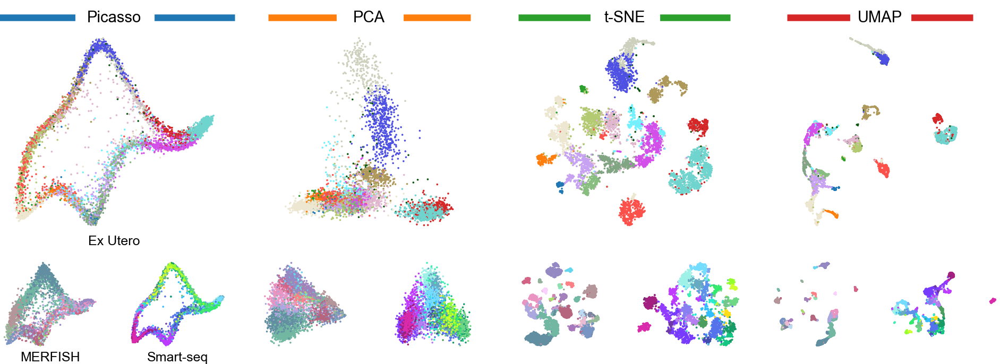

## The art of seeing the elephant in the room: <br/> 2D embeddings of single-cell data do make sense
<p align="center">

</p>


This repository holds the code to reproduce the analysis in [Lause, Berens & Kobak (2024) preprint ADD LINK](https://www.biorxiv.org) and shows [main and supplementary figures](results/figures). <p align="center">

</p>


To reproduce our analysis, follow the steps below. We assume you have `git` and `conda` installed.

### Install requirements

- Clone this repository.
```
git clone git@github.com:berenslab/elephant-in-the-room.git
```

- Inside the main folder of the repo, go to the `src` folder.
- In `src`, clone our Picasso fork.
- Go back to main folder.
```
cd src
git clone git@github.com:berenslab/picasso.git
cd ..
```

- Install the conda environment for Picasso.
```
conda env create -f src/picasso/env/env3.7_LINUX.yml
```

- Activate the `picasso_env` environment and install our Picasso fork in it.
```
conda activate picasso_env
pip install -e .
```

- Install our conda analysis environment.
```
conda env create -f environment.yml
```

### Run the analysis

- Activate our conda analysis environment.
- Start jupyter lab to run notebooks 1&2 in the `scripts` folder. This will download the data, run preprocesing and compute PCA, t-SNE and UMAP embeddings.
```
conda activate elephant_analysis_env
jupyter lab
```

- After that, activate the Picasso anvironment and start jupyter notebook to run notebook 3. This will run Picasso and create the elephant embeddings.
```
conda activate picasso_env
jupyter notebook
```

- After that, again activate our analysis environment.
- Start jupyter lab to run the remaining notebooks 4&5. This will run the evaluations and prepare the plots.
```
conda activate elephant_analysis_env
jupyter lab
```

### System information

We used `conda 23.11.0` on a recent laptop with 16GB RAM running `LINUX 6.5.0-18-generic #18~22.04.1-Ubuntu`. See [environment.yml](environment.yml) for more information on the analysis environment, and [env3.7_LINUX.yml](https://github.com/berenslab/picasso/blob/main/env/env3.7_LINUX.yml) for more information on the Picasso environment.
