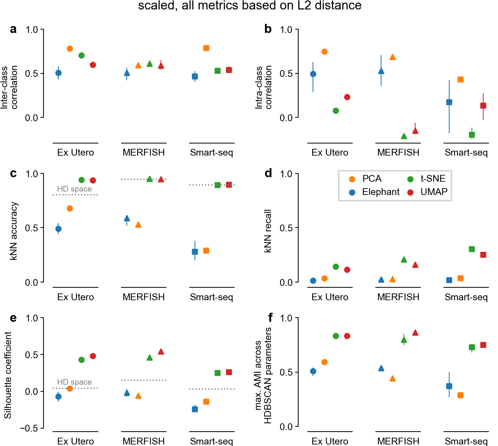
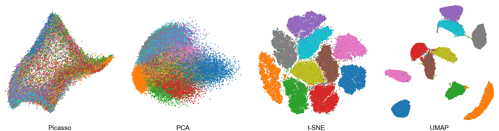
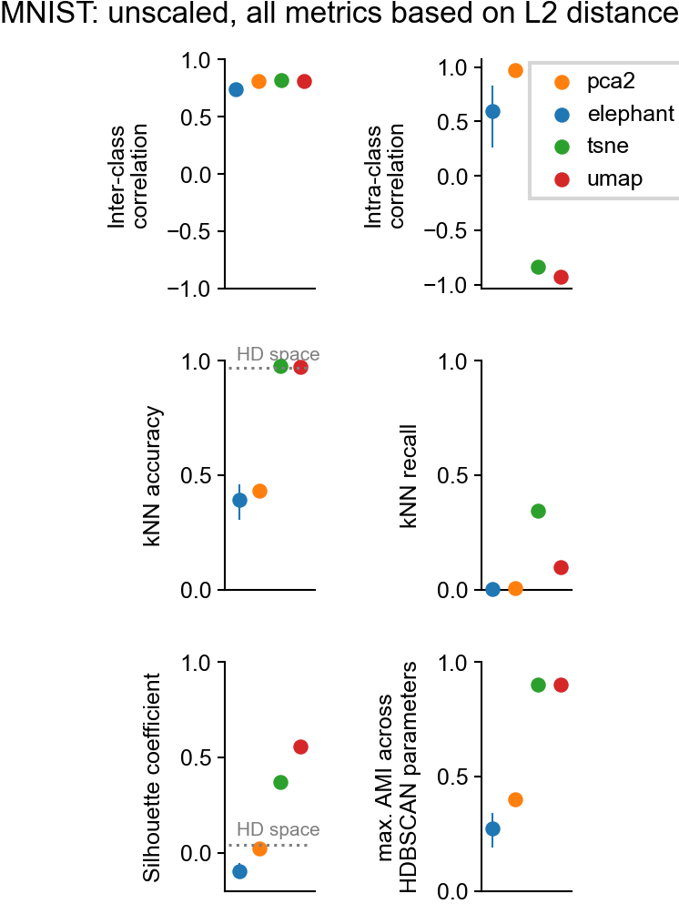

# Main figures
### Evaluated embeddings

### Metrics

# Supplementary figures 

### Correlation metrics with L1 vs L2 distance

### Using the Chari & Pachter scaling step

### Embeddings of the MNIST dataset

### Metrics for MNIST embeddings

