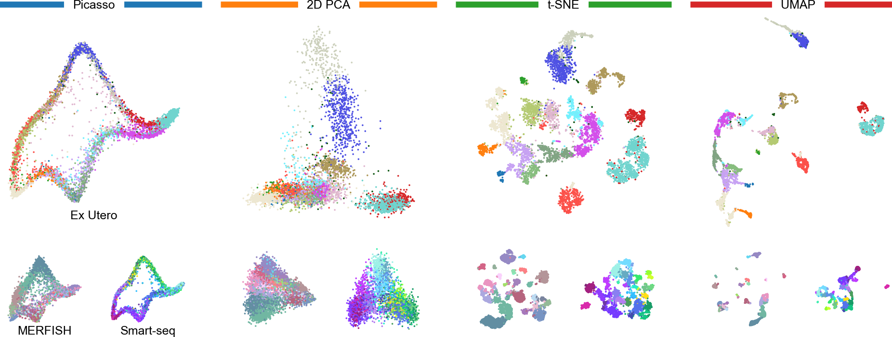

# Main figures
### Evaluated embeddings

### Metrics

# Supplementary figures 

### Additional dataset: Simulation based on the Ex Utero dataset

### Ex Utero dataset: Simulated vs. real counts

### Additional dataset: MNIST

### Correlation metrics with L1 vs. L2 distance

### Using the Chari & Pachter scaling step

